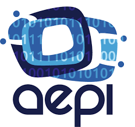

# Python-CursoProfesional :wrench:

## Descripción: 📄
Repositorio en el que se encuentra mi curso profesional de Python completo:
  - Curso impartido por la Asociación Española de Programadores informáticos.
  - Duración de 100 horas.
  - Nota obtenida: sobresaliente.

🧑🏻‍💻 Para más información del curso: https://asociacionaepi.es/curso-profesional-de-python/

## Contenidos: 🧑🏻‍🏫

💼 <a href="curso-profesional-de-Python.pdf">Pdf con todos los contenidos del curso</a>

  - CLASES: Contiene los archivos que fui creando a medida que el profesor imartía las clases.

  - También encontrarás carpetas con los ejercicios que se fueron planteando las distintas semanas.

  - Material proporcionado por el profesor: Contiene lo que el profesor nos fue dando durante el curso como enunciados de los ejercicios o teoría.

  - POO: Es una carpeta en la que encontrarás información acerca de la programación orientada a objetos en Python (no es del curso pero la hice porque me vino bien para los ejercicios).

  - PROYECTO FIN DE CURSO: Contiene el ejercicio propuesto como proyecto de fin de curso.

## Enlace a la asociación: :link:

